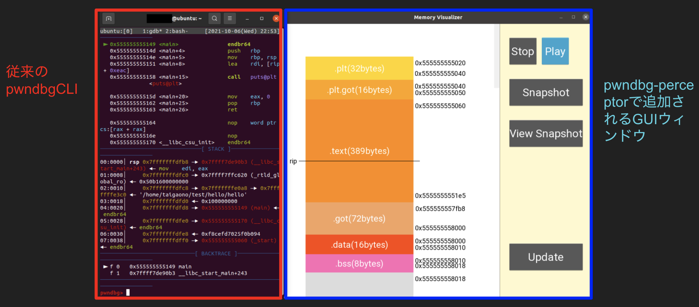

# pwndbg-perceptor

(English documentation is available [here](README_en.md))

GDBの拡張である[pwndbg](https://github.com/pwndbg/pwndbg)のforkです。初めてpwndbgを使うバイナリ入門者にとって出力される情報をわかりやすくすることでより効率的にpwndbgに使い慣れてもらったり、バイナリ解析の周辺知識を勉強/応用しやすくすることを主な目的とした拡張機能です。

## 機能概要

本家のpwndbgと同じく起動すると、従来のpwndbgのCLIに加え、pwndbg-perceptorのGUIが新しいウィンドウとして表示されます。

GUIの左側は実際pwndbgで起動している実行ファイルのメモリ内の現状を示しており、スクロールすることで全体が確認できます。GUIはデフォルトで常にpwndbg内で実行されている実行ファイルと同期されていて、リアルタイムで更新されています。（毎breakpointでGUIは更新されます）

## 互換性

### pwndbgのバージョン

pwndbg-perceptorは現時点で2021年9月21日の時点での本家のpwndbgのforkです。（特定のバージョンに依存しないように現在改良をしています）

### 使用OS

pwndbg-perceptorは現時点でLinux上でしか作動確認がされておらず、UTF-8に対応しているOSしか対応しておりません。（後程対応OSを広げる予定です）

## 実装詳細/貢献

pwndbg-perceptorはpwndbgのソースコード内の`/path/to/perceptor/`（TODO: 実際のパスを入力）内からperceptor専用のコードを`/pwndbg/commands/context.py`等の本家のスクリプトに実行してもらうことで作動しています。

現在pwndbgのforkとして開発を進めていますが、いずれはpwndbgへのpull requestとして実装していくことを目標としています。

pwndbg-perceptorへコードの修正/機能の追加実装などは大歓迎です。Issueを立てていただいて、該当するpull requestを立てていただければこちらで対応いたします。（返事/対応に時間がかかることもありますが、ご了承ください）

### 解析対象

現時点で解析対象はx86_64のバイナリしか想定していません（対応OS同様、対応範囲は後程広げる予定です）

## 操作

GUIの右側には複数ボタンがあり、以下の通り機能します：

- `Stop/Play`: GUIのリアルタイム更新を中断/再開します
- `Snapshot`: 現在の状態のメモリの表示を一時的に保存します（現状再起動するとsnapshotはリセットされます）
- `View Snapshot`: Snapshotボタンで撮ったsnapshotを確認することができます
- `Update`: たまに更新がされない/バグる時があるので、そのために手動で最新の状態へGUIの表示を更新させます

その他可能な操作：

- マーキング：pwndbgのCLI内で`mark <マークしたいアドレス>`（例：`mark 0xfffffffffd50`）と入力するとGUI内にそのマークの相対的な位置を表す線が引かれます。マーキングは複数回行え、その都度GUI上で各マークに番号が振られます。マーキングを外したい場合は`unmark <マークに振られた番号>`（例：`unmark 5`）と入力すればマークを取り除けます。CLI上で現在つけてあるマーキングを確認したい場合は`mark list`で確認できます。

### snapshot

### freeze

### mark

##　表示内容

### セクション

以下の通りにセクションを分け、相対的なサイズに応じてGUI上の表示の大きさを調節しています（実際のセクションのサイズ通りで各セクションの表示サイズを変えると極端に見えづらくなるので、大きいセクションほど拡大する度合いを減らしています）：
- .plt
- .plt.got
- .text
- .got
- .got.plt
- .data
- .bss
- heap
- None（heap/stack用の未使用のメモリ領域）
- libc
- ld
- stack_unusued（stack内でallocateされているが、未使用の領域）
- stack（stack内で値が入っていて、使用されている領域）

各セクションはGUI上にブロックとして表示されており、名前、開始/終了アドレス、及びサイズでラベルされています。

### レジスタ値

現在のRIP、RSPレジスタが指しているアドレスが線で示されています。

### スタックフレーム

スタック内にはスタックフレーム（mainフレーム以降）の相対的な位置/サイズが白い線でマークされています。

## 実装予定の機能

- Heap内の構造体等のさらに多くのメモリ内の要素を可視化
- GUIのUI/UXの改善
- mark機能をGUIからアクセス可能にする
- （もし上記に記載されていない追加希望の要素などがあれば提案大歓迎です）

## 現在確認されているバグ/おかしな挙動

TODO
