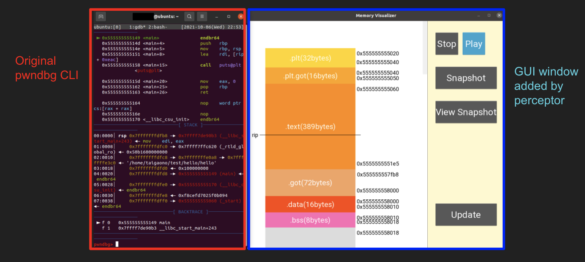

# pwndbg-perceptor

This is a fork of [pwndbg](https://github.com/pwndbg/pwndbg), an extension to GDB. This extension is aimed towards beginners of binary analysis/exploitation, as an attempt to build on the readability and useability that pwndbg already provides, providing a better learning experience for people new to the tool.

## Functionality

Install this fork the same way you would for the original pwndbg. When launching pwndbg the same way as you would for the original, a GUI window will be displayed in addition to the original pwndbg CLI.

To the left of the GUI, the size and order of the contents of the memory of the executable file under analysis is shown. By default, this display is constantly updated and in sync with what the pwndbg CLI displays. (GUI is updated on every breakpoint)

## Compatibility

### pwndbg version

pwndbg-perceptor was forked from pwndbg on 9/21/2021 and thus, only supports pwndbg at that point. (We are currently working towards improving on this)

### Compatible OS

pwndbg-perceptor has only been tested on Linux at this point. This fork only supports OS that supports UTF-8 as well. (We are currently working on expanding the range of compatible OS)

## Implementation Details/Contribution

pwndbg-perceptor is implemented by placing original code in `/pwndbg/perceptor/`, `/pwndbg/perceptorGUI/`, and having original pwndbg files like `/pwndbg/commands/context.py` call them to function.

We plan on opening a pull request to the original pwndbg once we are able to smooth out the (many) edges this extension currently has. Please keep in mind that this fork is currently at its prototype stage, and that a pull request to the original pwndbg may be far ahead in time.

We welcome error fixes to existing code, as well as implementation of additional functionality. Please open a new issue, as well as the corresponding pull request, and we will be happy to work with you. (Please keep in mind that we may take a while to respond to requests)

### Analysis Target

At this point, pwndbg-perceptor is capable of only analyzing x86_64 executables. (Much like the compatible OS, we plan on expanding this range)

## Controls

To the right of the GUI, there are a series of buttons enabling the following functionality:

- `Stop/Play`: Pause/resume the real-time update of the executable's memory
- `Snapshot`: Take a snapshot of the current state of memory (snapshot will be lost once the debugging session is reset)
- `View Snapshot`: View the snapshot taken by the snapshot button
- `Update`: There are times where the GUI fails to update correctly, in which case this button should be used to manually update the display

Other controls:

- Marking: Within the pwndbg CLI, input `mark <address you want to mark>` (ex: `mark 0xfffffffffd50`) to place a marker on the GUI display in the form of a horizontal line. Multiple markers can be placed, each being indexed with increasing ID. To remove markers, input `unmark <ID of marker you want to remove>` (ex: `unmark 5`). Furthermore, input `mark list` to display the list of current markers, as well as their ID.

### snapshot

### freeze

### mark

## Displayed Contents

### Sections

Sections are divided into the following sections, and displayed as blocks of sizes based on their actual size. (Note that the size of blocks aren't directly proportional to their actual sizes. Doing so would make some sections too small/large to view, even with scrolling):
- .plt
- .plt.got
- .text
- .got
- .got.plt
- .data
- .bss
- heap
- None（empty memory left for stack/heap to allocate from）
- libc
- ld
- stack_unusued（allocated, but unused memory by stack）
- stack（memory allocated/used by stack）

Each section blocks are labeled with their name, start/end addresses, as well as their respective sizes.

### Register Values

Addresses pointed by RIP and RSP are marked on the GUI.

### Stack Frame

The relative position/sizes of stack frames are displayed by white boxes.

## Planned Functionality

- Visualization of additional elements, such as heap constructs
- Improvements to UI/UX
- Enabling marking from GUI
- (If you want a functionality that is not listed here, feel free to reach out)

## Known Bugs/Weird Behavior

TODO